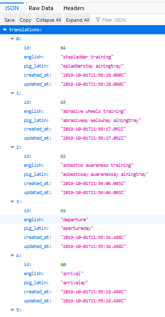

# English to Pig Latin translation service (backend)

Single-page, web app with CRUD functionality created using a [React.js frontend](https://github.com/olliebrownlow/pig-latin-react-frontend) and rails backend. On the translator view the app allows a user to translate into Pig Latin any phrase they wish. A button takes the user to a history of their translations where they can delete and update individual entries as well as sort and search through them.

### Getting started

Clone the repo, navigate to the root directory and run `bundle install` to install the gems. Run `rails server --port=3001` to start it in development mode (localhost:3001). The react frontend can be started on port 3000.

The frontend is available [here](https://github.com/olliebrownlow/pig-latin-react-frontend) and should be set up after setting up the backend.

### Tech stack

- Ruby on Rails 6.0.0
  - Rspec-rails 3.8 for testing
  - Active Record
- React.js 16.10.1
- PostgreSQL 10

### Code design

The terminology controller implements full CRUD functionality and communicates with the Terminology class and PostgreSQL via Active Record to translate the English term into Pig Latin before saving to the database.

I have leveraged the fact that the model returns a downcase translation by using it to avoid multiple entries into the database of the same terminology (even if receiving different versions of the same one, e.g fire, Fire, fIre, FIrE etc.). It does so by checking if there are any records in the db where the Pig Latin version matches the newly supplied entry's Pig Latin translation.

### Business logic

The model takes an English word or phrase as input and returns that word or phrase in lowercase Pig Latin.

It removes any undesired characters and creates an array where the elements are the words in the phrase. It then maps over the elements processing each one into Pig Latin in accordance with the [translation rules](https://en.wikipedia.org/wiki/Pig_Latin#Rules), finally returning a new array which is joined back into a phrase.

### Testing

From the root directory, run `rspec`. The coverage is currently 97.82%

### Edge cases

- Edge cases are dealt with in the frontend by restricting what can be sent in axios requests.

### If I could start over..

The implementation neglects to categorise the inputted terminology into relevant categories (Health & Safety, Hazardous Substances etc.). If I were to start over I would build in these options with a dropdown select menu next to each term inputted. The select menu would allow the user to specify a category. This could then be sent in POST and PUT requests requiring another column in the database (relative to the current implementation). This data could be used to make, for example, multiple searchable tables, one for each category, and perhaps also a joint table showing all saved items.

### Screenshot

